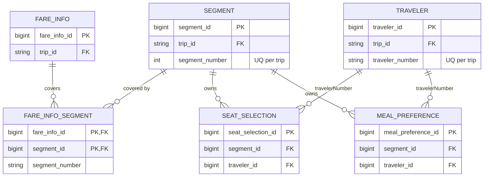
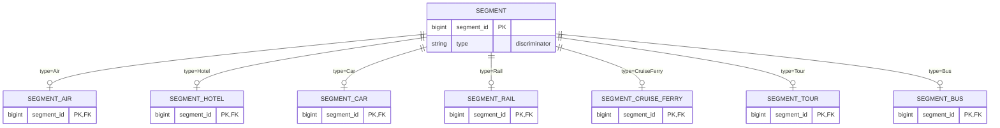

# TDP Trip — Entity Relationship Diagram (Tier 1 Core)

This ERD visualizes the relational design in `tdp-trip-database-design.md`.

**How to read the crow's-foot notation:**
- `||--||` = one-to-one
- `||--o{` = one-to-many (zero or more children)
- `||--|{` = one-to-many (one or more children)
- `||--o|` = one-to-zero-or-one (the optional 1:1 subtype tables)
- A box that sits **between** two others (e.g. `FARE_INFO_SEGMENT`) is a **junction** resolving a many-to-many.

> Tip: paste this file into any Mermaid-enabled viewer (VS Code Mermaid preview, GitHub, mermaid.live). Cursor renders it inline.

---

## 1. Full Tier 1 ERD

```mermaid
erDiagram
    TRIP ||--|| TRIP_DETAILS : "1:1"
    TRIP ||--o{ RELATED_BOOKING : "1:N"
    TRIP ||--|{ TRAVELER : "1:N"
    TRIP ||--o{ CONTACT_PHONE : "1:N"
    TRIP ||--o{ CONTACT_EMAIL : "1:N"
    TRIP ||--|{ SEGMENT : "1:N"
    TRIP ||--o{ FARE_INFO : "1:N"
    TRIP ||--o{ REMARK : "1:N"

    TRIP_DETAILS ||--o{ TRIP_EVENT : "1:N"
    TRIP_DETAILS ||--o{ TRIP_SERVICE_CATEGORY : "1:N"
    TRIP_DETAILS ||--o{ ITINERARY_REMARK : "1:N"

    TRAVELER ||--o{ TRAVELER_LOYALTY_MEMBERSHIP : "1:N"
    TRAVELER ||--o{ TRAVELER_SEAT_PREFERENCE : "1:N"
    TRAVELER ||--o{ TRAVELER_IDENTIFIER : "1:N"

    SEGMENT ||--o| SEGMENT_AIR : "1:0..1"
    SEGMENT ||--o| SEGMENT_HOTEL : "1:0..1"
    SEGMENT ||--o| SEGMENT_CAR : "1:0..1"
    SEGMENT ||--o| SEGMENT_RAIL : "1:0..1"
    SEGMENT ||--o| SEGMENT_CRUISE_FERRY : "1:0..1"
    SEGMENT ||--o| SEGMENT_TOUR : "1:0..1"
    SEGMENT ||--o| SEGMENT_BUS : "1:0..1"

    SEGMENT ||--o{ SEAT_SELECTION : "1:N"
    SEGMENT ||--o{ MEAL_PREFERENCE : "1:N"
    SEGMENT ||--o{ STOP_CITY : "1:N"
    SEGMENT ||--o{ SEGMENT_REMARK : "1:N"
    SEGMENT ||--o{ HOTEL_RATE_CHANGE_INFO : "1:N (Hotel)"
    SEGMENT ||--o{ CAR_SPECIAL_EQUIPMENT : "1:N (Car)"

    %% ---- critical many-to-many: fares link to segments by segmentNumber ----
    FARE_INFO ||--o{ FARE_INFO_SEGMENT : ""
    SEGMENT   ||--o{ FARE_INFO_SEGMENT : ""

    %% ---- critical many-to-one: seat / meal name a traveler by travelerNumber ----
    TRAVELER ||--o{ SEAT_SELECTION : "by travelerNumber"
    TRAVELER ||--o{ MEAL_PREFERENCE : "by travelerNumber"

    %% ---- shared address, referenced 1:1 by several owners ----
    SEGMENT_AIR   }o--|| ADDRESS : "dep_address"
    SEGMENT_AIR   }o--|| ADDRESS : "arr_address"
    SEGMENT_CAR   }o--|| ADDRESS : "pickup_address"
    SEGMENT_CAR   }o--|| ADDRESS : "dropoff_address"
    SEGMENT_HOTEL }o--|| ADDRESS : "property_address"
    SEGMENT_RAIL  }o--|| ADDRESS : "start_station_address"
    SEGMENT_RAIL  }o--|| ADDRESS : "end_station_address"

    TRIP {
        string  trip_id PK "= identification.id"
        string  source_id
        string  record_locator
        string  gds
        string  global_customer_number
        string  account_id
        string  data_type
        string  client_id
        string  company_id
    }
    TRIP_DETAILS {
        string  trip_id PK,FK
        datetime booking_date_time
        datetime ticketed_date_time
        datetime trip_start_date_time
        datetime trip_end_date_time
        string  trip_status
        bool    is_cancelled
        string  flight_type
        bool    is_international
    }
    TRIP_EVENT {
        bigint  event_id PK
        string  trip_id FK
        string  key
        string  value
    }
    TRIP_SERVICE_CATEGORY {
        bigint  service_category_id PK
        string  trip_id FK
        string  code
        string  description
    }
    ITINERARY_REMARK {
        bigint  itinerary_remark_id PK
        string  trip_id FK
        int     seq
        string  value
    }
    RELATED_BOOKING {
        bigint  related_booking_id PK
        string  trip_id FK
        string  related_trip_id
        string  record_locator
        string  gds
    }
    TRAVELER {
        bigint  traveler_id PK
        string  trip_id FK
        string  traveler_number "UQ(trip_id,traveler_number)"
        string  name_first
        string  name_last
        string  name_in_gds
        string  country_code
    }
    TRAVELER_LOYALTY_MEMBERSHIP {
        bigint  loyalty_id PK
        bigint  traveler_id FK
        string  supplier_type
        string  supplier
        string  member_number
    }
    TRAVELER_SEAT_PREFERENCE {
        bigint  seat_pref_id PK
        bigint  traveler_id FK
        string  location_code
        string  location_text
        string  notes
    }
    TRAVELER_IDENTIFIER {
        bigint  identifier_id PK
        bigint  traveler_id FK
        string  key
        string  value
    }
    CONTACT_PHONE {
        bigint  phone_id PK
        string  trip_id FK
        string  number "NOT NULL"
        string  type
    }
    CONTACT_EMAIL {
        bigint  email_id PK
        string  trip_id FK
        string  email_address "NOT NULL"
        string  type
        bool    is_primary
    }
    SEGMENT {
        bigint  segment_id PK
        string  trip_id FK
        string  type "NOT NULL (discriminator)"
        int     segment_number "UQ(trip_id,segment_number)"
        string  title
        string  confirmation_number
        datetime start_date_time
        datetime end_date_time
        string  status_code
        string  status_description
        bool    is_cancelled
    }
    SEGMENT_AIR {
        bigint  segment_id PK,FK
        string  dep_airport_code
        bigint  dep_address_id FK
        string  arr_airport_code
        bigint  arr_address_id FK
        string  marketing_airline_code
        string  marketing_flight_number
        string  class_of_service_code
        string  flight_direction
    }
    SEGMENT_HOTEL {
        bigint  segment_id PK,FK
        string  property_code
        string  property_name
        bigint  property_address_id FK
        int     number_of_nights
        decimal fare_estimated_total_amount
        string  fare_estimated_total_currency
    }
    SEGMENT_CAR {
        bigint  segment_id PK,FK
        string  rental_company_code
        bigint  pickup_address_id FK
        bigint  dropoff_address_id FK
        int     number_of_days
        decimal fare_base_rate_amount
    }
    SEGMENT_RAIL {
        bigint  segment_id PK,FK
        string  carrier_code
        string  start_station_code
        bigint  start_station_address_id FK
        string  end_station_code
        bigint  end_station_address_id FK
        string  train_number
        string  train_class_code
        decimal fare_rate_quote_amount
    }
    SEGMENT_CRUISE_FERRY {
        bigint  segment_id PK,FK
    }
    SEGMENT_TOUR {
        bigint  segment_id PK,FK
    }
    SEGMENT_BUS {
        bigint  segment_id PK,FK
    }
    SEAT_SELECTION {
        bigint  seat_selection_id PK
        bigint  segment_id FK
        bigint  traveler_id FK
        string  traveler_number
        string  location
    }
    MEAL_PREFERENCE {
        bigint  meal_preference_id PK
        bigint  segment_id FK
        bigint  traveler_id FK
        string  traveler_number
        string  code
    }
    STOP_CITY {
        bigint  stop_city_id PK
        bigint  segment_id FK
        string  city_code
        string  city_name
    }
    SEGMENT_REMARK {
        bigint  segment_remark_id PK
        bigint  segment_id FK
        int     seq
        string  value
    }
    HOTEL_RATE_CHANGE_INFO {
        bigint  rate_change_id PK
        bigint  segment_id FK
        datetime begin_date_time
        datetime end_date_time
        decimal rate_amount
    }
    CAR_SPECIAL_EQUIPMENT {
        bigint  car_equipment_id PK
        bigint  segment_id FK
        int     seq
        string  value
    }
    FARE_INFO {
        bigint  fare_info_id PK
        string  trip_id FK
        decimal fare_amount
        string  fare_currency
        decimal estimated_total_fare_amount
        string  estimated_total_fare_currency
    }
    FARE_INFO_SEGMENT {
        bigint  fare_info_id PK,FK
        bigint  segment_id PK,FK
        string  segment_number "original value"
    }
    REMARK {
        bigint  remark_id PK
        string  trip_id FK
        int     line_number
        int     type
        string  category
        string  contents
    }
    ADDRESS {
        bigint  address_id PK
        string  address1
        string  city_name
        string  region_code
        string  postal_code
        string  country_code
        string  latitude
        string  longitude
    }
```

---

## 2. Focused view — the critical links only

If the big diagram is busy, this is the part that must be exactly right (the number-based cross-references):

**Key points the diagram encodes:**
- `FARE_INFO_SEGMENT` is the junction making `fareInfos ↔ segments` a true **many-to-many** (in the example one fare covered segments `1` and `5`).
- `SEAT_SELECTION` / `MEAL_PREFERENCE` are **owned by a segment** but **point to a traveler** (many-to-one) — two FKs out of one row.
- The `UQ per trip` notes are the uniqueness constraints that make resolving `segmentNumber` / `travelerNumber` unambiguous.

---

## 3. Segment inheritance (CTI) — zoom

Exactly **one** subtype row exists per `SEGMENT`, chosen by `SEGMENT.type`. The subtype's PK *is* the FK to `SEGMENT` (shared primary key = guaranteed 1:1).
